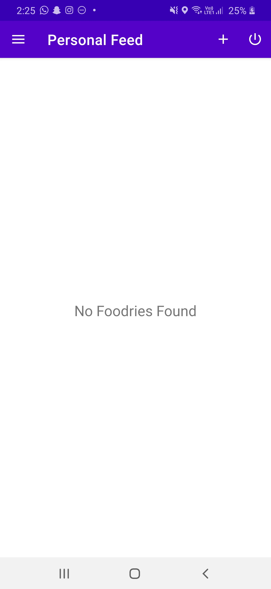

**FOODIE MOODIE**

Foodie Moodie is an Android App for Food Lovers. It provides users to use App as two Options :

1) As Guest: This mode is based on Room Database using Local Storage Of Android Phone. In this option, user can search different recipes and its related ingredients , information , blog through SPOONACULAR API using Retrofit API. 
Also User can save a particular recipe for future usage in phone local storage using Room Database. Also API DATA is offline cached in Room Database to reduce API calls and increase efficiency and working fluency of App. User can also find nearby Restaurants using Google Maps API. 

2) Firebase Online User : This mode is completely based on Firebase. User make an online account and get access to all Global Feed . User can add/ edit / delete different food memories in two different modes : public and private. Public mode add food memory to Global Feed and private mode add food memory to personal feed only.  User can search different recipes and its related ingredients , information , blog through SPOONACULAR API using Retrofit API and can save different recipes for future usage, these recipes will get saved in Firebase so that user can access its saved recipes and personal feed by logging in from different phones.  User can also find nearby Restaurants using Google Maps API. 

## 📸 Screenshots

|||||
|:----------------------------------------:|:-----------------------------------------:|:-----------------------------------------: |:-----------------------------------------: |
|  |  |  |  |
|  |    |  |     | 
|  |  |  |  |
|   |  |  |  |

FEATURES/LEARNINGS/PRACTICES USED:

1.) CRUD operations on Firebase Firestore.

2.) Use Of Firebase Authentication for user authentication

3.) Use of Spoonacular API through Retrofit and GOOGLE MAPS API.

4.) Use Of Room Database for storing recipes and also for Offline Caching of Online Data

5.) MVVM pattern Architecture, Navigation Component, Shared Preferences, Live Data, Coroutines, View Model etc. 

https://user-images.githubusercontent.com/70480242/131448986-f3a0a7de-6915-4a07-804c-1dfea722455f.mp4

